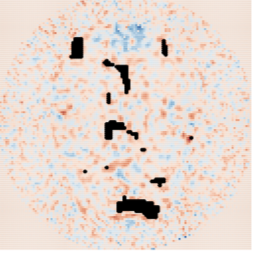
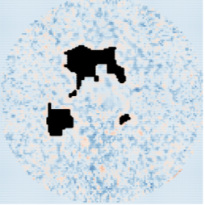
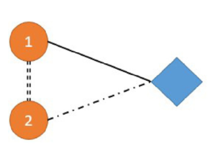
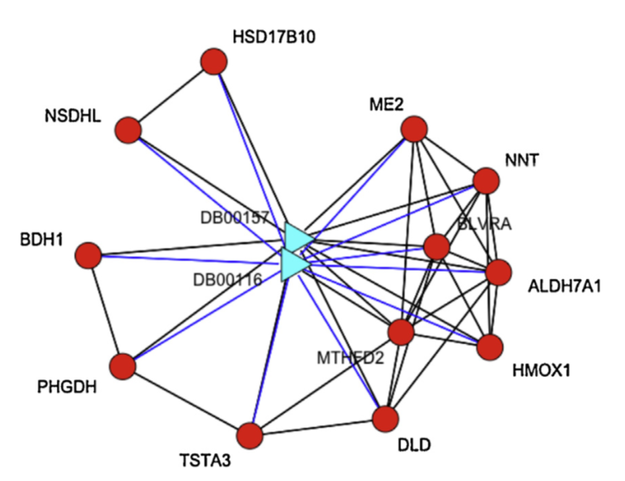

&nbsp;
<html>
<head>
<meta name="viewport" content="width=device-width, initial-scale=1">

</head>
<body>
<!--  -->
### **Ongoing Projects**

**Spatial Model Heterogeneity Study**  [Jan 2018 – Current]{style="float:right"}

-- Advisor: Dr. Zhengyuan Zhu, (Stat Dept.@ISU)  

* The recent development of remote sensing and satellite technology makes large-scale datasets become available. In this project, we aim to study the spatial pattern of the relationship between a response variable and a set of explanatory variables. Our method is to detect spatially contiguous clusters based on the model coefficients.      
* [Preprint](https://arxiv.org/pdf/1905.11549.pdf)

|   | 
|---|
| {width=250px} |

&nbsp;
**Decentralized Algorithm Design**  [Dec 2017 – Current]{style="float:right"}   
-- Advisor: Dr. Jia Liu, (CS Dept.@ISU)  

* Decentralized network consensus optimization has received increasing attention in recent years and has found important applications in many scientific and engineering fields. In this project, we focus on improving the decentralized algorithm from the perspectives of computation speed, communication efficiency, and data privacy, etc.     
* [INFOCOM'19](https://arxiv.org/pdf/1812.04048.pdf), [INFOCOM'20](https://arxiv.org/pdf/1912.03208.pdf),
[Mobihoc'20](https://arxiv.org/pdf/2001.03836.pdf)

|   |   |   |
|---|---|---|
|{width=220px}|{width=240px}|{width=200px}|

&nbsp;

### **Past Projects**

<button class="collapsible">**Robust Distributed Algorithm Design**  [Dec 2017 – Dec 2019]{style="float:right"}  </button>

-- Advisor: Dr. Jia Liu, (CS Dept.@ISU)  

* Distributed stochastic optimization strategies have been adopted to facilitate deep machine learning training. In this project, we aim to design and study the distributed stochastic algorithms with the tolerance of Asynchronous and Byzantine workers.    
* [CDC'19](https://arxiv.org/pdf/1909.04532.pdf),
[SPAWC'20](http://web.cs.iastate.edu/~jialiu/publications/sign2SGD.pdf),[CDC'20](https://arxiv.org/pdf/1805.09470.pdf)   

|   |
|---|
|{width=220px}|

&nbsp;
<button class="collapsible">**Spatial Weak Signal Detection**  [Dec 2016 – May 2018]{style="float:right"}  </button>

-- Advisor: Dr. Zhengyuan Zhu, (Stat Dept.@ISU)  

* We propose a detection method (SCUSUM) to detect weak spatial signals, which is based on the conventional CUSUM method for change-point detection. The statistical properties of SCUSUM are analyzed in our work, which implies that this method could identify the abnormal region w.h.p. We apply this method to fMRI data to identify the active regions.      
* [Preprint](https://lib.dr.iastate.edu/cgi/viewcontent.cgi?article=1049&context=creativecomponents)
  

|   |   |   |   |
|---|---|---|---|
|{width=240px}| {width=240px} |{width=180px} |{width=180px} |

&nbsp;
<button class="collapsible">**Drug-Target Interaction Prediction**  [Sept 2014 – Jun 2016]{style="float:right"}  </button>

-- Advisor: Dr. Shuqin Zhang (Math Dept.@FDU)   

* We propose a multiview drug-target interaction prediction method (MVDTI) based on network clustering and co-training. This method can identify the drug-target clusters in both drug and target protein similarity networks. We predict potential DTI pairs based on the LINCS database and conducting enrichment analysis on the detected co-modules to assess the prediction accuracy.     
* [Computational Biology and Chemistry'17](https://www.sciencedirect.com/science/article/pii/S1476927117301950)

|   |   |   |
|---|---|---|
|{width=150px}| {width=330px} |{width=220px} |

&nbsp;
<button class="collapsible">**Electricity Consumer Characteristics Study**  [May 2015 – Jun 2016]{style="float:right"}  </button>

-- Advisor: Dr. Weiguo Gao (Math Dept.@FDU)  

* We apply the kernel method to estimate the continuous curves of daily data with the missing values. Then the functional k-means algorithm is conducted on the electricity consumption data to cluster Consumers in Shanghai.     
* [Power System Technology'15](http://new.oversea.cnki.net/KCMS/detail/detail.aspx?dbcode=CJFQ&dbname=CJFDLAST2015&filename=DWJS201511025&v=MDU3NzFOcm85SFlZUjhlWDFMdXhZUzdEaDFUM3FUcldNMUZyQ1VSTE9mWWVkcUZ5bmtWN3ZLSVRyQmZiRzRIOVQ=)

|   |   |
|---|---|
|{width=300px}| {width=300px} |

</body>
</html>
