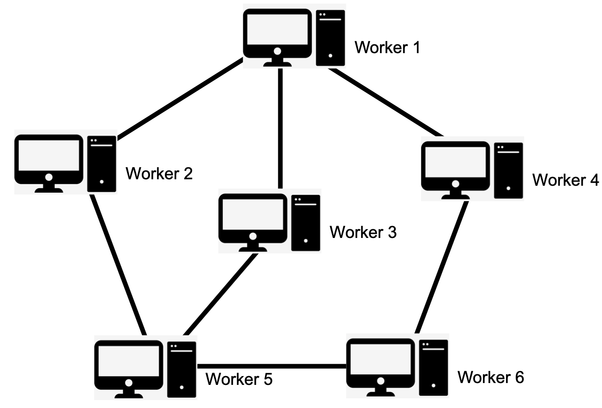
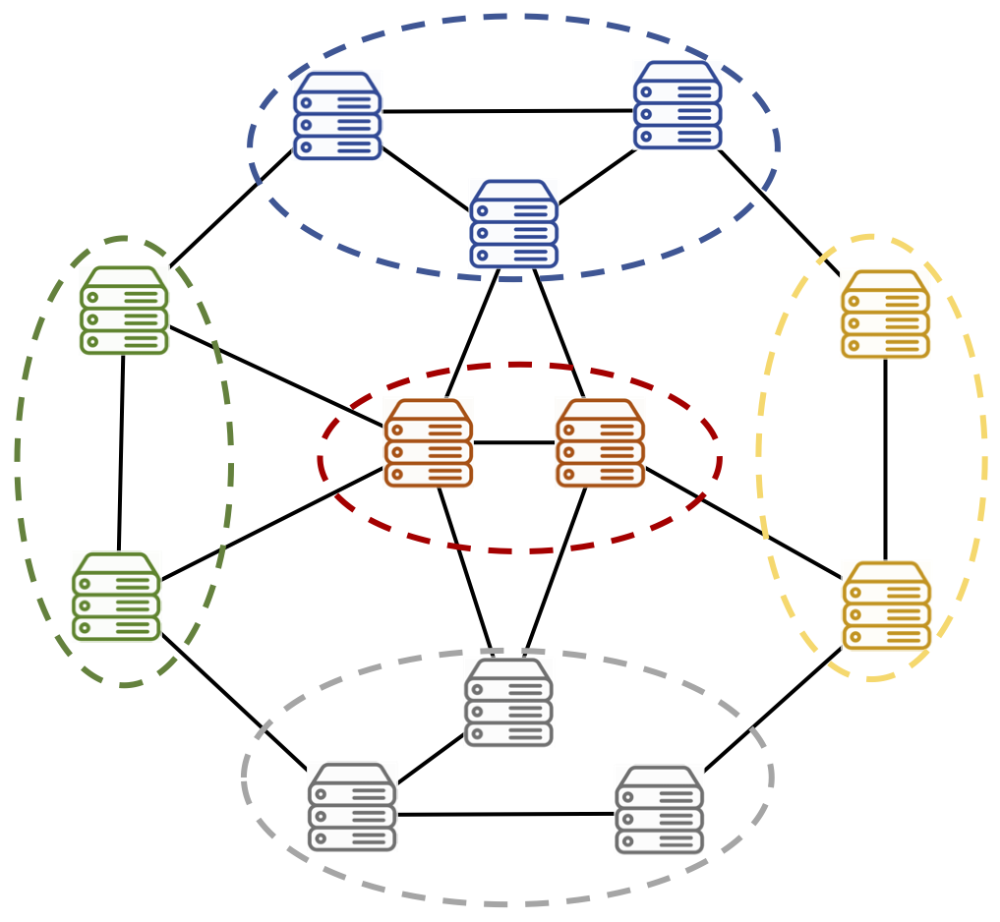
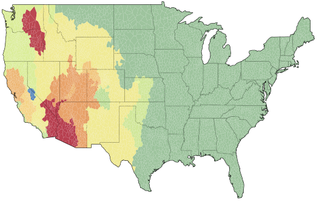
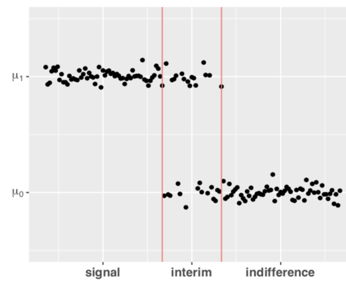
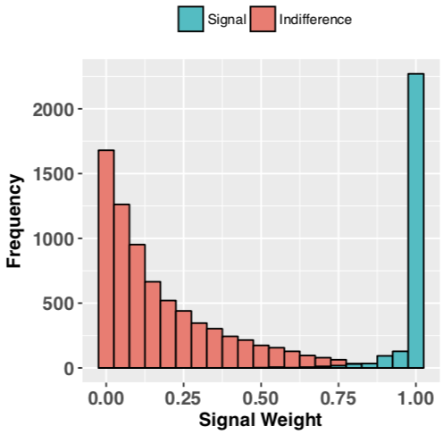
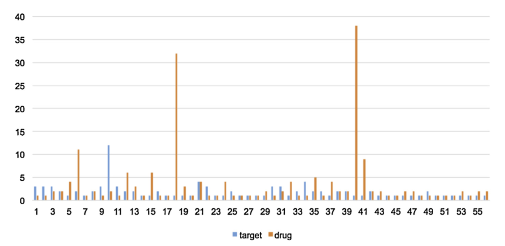
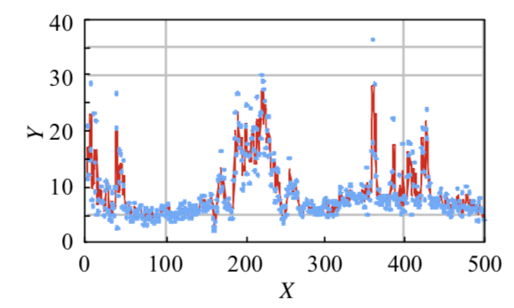

&nbsp;
<html>
<head>
<meta name="viewport" content="width=device-width, initial-scale=1">

</head>
<body>
<!--  -->
### **Ph.D. Projects**

**Consensus Learning in Distributed System**  [Dec 2017 – Dec 2020]{style="float:right"}   
-- Advisor: Dr. Jia Liu, (CS Dept.@ISU)   

* Distribued learning algorithms work with the system formed by a group of computational nodes, each of which can locally store the data and pass the message in the system. The goal of these algorithm is to train a global learning model based on all nodes’ data through local computation and neighboring communication. Current distributed learning methods suffer from 1) high sample complexity due to the large local datasets; 2) inefficient communication caused by the low network bandwidth and complex model structure; 3) significant loss of data privacy when untrustable nodes exist; 4) unreliable performance due to the asynchronous and byzantine nodes. Our work focuses on designing decentralized algorithms that can overcome these problems. The following table summarizes our works.  
  

| Algorithm | System | Low Samp. | Low Commi. | Privacy  | Robustness | Reference |
|:-:|:-:|:-:|:-:|:-:|:-:|:-:|
|ADC-DGD  | P2P-Network| -- | &#10004;  |-- | --| [INFOCOM'19](https://arxiv.org/pdf/1812.04048.pdf) | 
|LICM-SGD  | Star-Network| -- | --  |-- | &#10004; | [CDC'19](https://arxiv.org/pdf/1909.04532.pdf)| 
| MH-signSGD| Star-Network| -- | &#10004;  |-- |  &#10004;| [SPAWC'20](https://ieeexplore.ieee.org/abstract/document/9154256) | 
|Async-SGD/SGDI  | Star-Network| -- | --  |-- | &#10004; | [CDC'20](https://arxiv.org/pdf/1805.09470.pdf) | 
|DC-DGD |P2P-Network| -- |&#10004;| --|-- | [INFOCOM'20](https://arxiv.org/pdf/1912.03208.pdf)|
|SDM-DSGD |P2P-Network| -- |&#10004; |&#10004;| --|  [MOBIHOC'20](https://arxiv.org/pdf/2001.03836.pdf)|
|TH-DSGD |P2P-Network| &#10004; | &#10004; |-- |-- | [INFOCOM'21]() |

|   |   |    | 
|:-:|:-:|:-:|
|{height=250px}|{height=250px} |{height=250px}|
|Star-Network| |    P2P-Network|

&nbsp;

**Heterogeneous Modeling with Network Topology**  [Jan 2018 – Dec 2020]{style="float:right"}

-- Advisor: Dr. Zhengyuan Zhu, (Stat Dept.@ISU)    

* Heterogeneous modeling aims to simultaneously estimate model parameters and cluster observations based on model similarity, thus also known as model-based clustering analysis. 
To date, this topic has attracted a surge of research interests and found important applications in many scientific fields, such as personalized medicine, image analysis, and economic study, etc.
Although various methods have been proposed, most of them tackle the problem without considering the underlying structure restriction among the observations. 
Additionally, to simultaneously solve the estimation and clustering tasks, existing methods (e.g., EM algorithm, pairwise fusion, etc.) often necessitate intensive computations.
To address these issues, we proposed efficient fusion penalized methods by utilizing the network/graph structure of data while only requiring a low computation complexity.     
  

| Method | Model | Penalty | # Cluster Indiv. | # Local Obs. | Task | Reference |
|:-:|:-:|:-:|:-:|:-:|:-:|:-:|
|DTFLR  | Linear Model | Adaptive Tree Lasso | $m = O(1)$  | $n \rightarrow \infty$ | Distributed Data Integration | [Short Version](https://arxiv.org/pdf/1905.11549.pdf) | 
|SHAPLM | Partial Linear Model | Forest Lasso | $m \rightarrow \infty$  | $n = O(1)$  | Image Segmentation | [Available on Request]() | 

|   |    |     | 
|:-:|:-:|:-:|
|{height=250px} | {height=250px} | {height=250px} |
| Distributed Data Integration |    |  Image Segmentation   | 

&nbsp;

### **Past Projects**
<button class="collapsible">**Spatial Weak Signal Detection**  [Dec 2016 – May 2018]{style="float:right"}  </button>

-- Advisor: Dr. Zhengyuan Zhu, (Stat Dept.@ISU)  

* We propose a detection method (SCUSUM) to detect weak spatial signals, which is based on the conventional CUSUM method for change-point detection. The statistical properties of SCUSUM are analyzed in our work, which implies that this method could identify the abnormal region w.h.p. We apply this method to fMRI data to identify the active regions.      
* [Preprint](https://lib.dr.iastate.edu/cgi/viewcontent.cgi?article=1049&context=creativecomponents)
  

|   |   |   |   |
|:-:|:-:|:-:|:-:|
|{width=240px}| {width=240px} |{width=180px} |{width=180px} |

&nbsp;
<button class="collapsible">**Drug-Target Interaction Prediction**  [Sept 2014 – Jun 2016]{style="float:right"}  </button>

-- Advisor: Dr. Shuqin Zhang (Math Dept.@FDU)   

* We propose a multiview drug-target interaction prediction method (MVDTI) based on network clustering and co-training. This method can identify the drug-target clusters in both drug and target protein similarity networks. We predict potential DTI pairs based on the LINCS database and conducting enrichment analysis on the detected co-modules to assess the prediction accuracy.     
* [Computational Biology and Chemistry'17](https://www.sciencedirect.com/science/article/pii/S1476927117301950)

|   |   |   |
|:-:|:-:|:-:|
|{width=150px}| {width=330px} |{width=220px} |

&nbsp;
<button class="collapsible">**Electricity Consumer Characteristics Study**  [May 2015 – Jun 2016]{style="float:right"}  </button>

-- Advisor: Dr. Weiguo Gao (Math Dept.@FDU)  

* We apply the kernel method to estimate the continuous curves of daily data with the missing values. Then the functional k-means algorithm is conducted on the electricity consumption data to cluster Consumers in Shanghai.     
* [Power System Technology'15](http://new.oversea.cnki.net/KCMS/detail/detail.aspx?dbcode=CJFQ&dbname=CJFDLAST2015&filename=DWJS201511025&v=MDU3NzFOcm85SFlZUjhlWDFMdXhZUzdEaDFUM3FUcldNMUZyQ1VSTE9mWWVkcUZ5bmtWN3ZLSVRyQmZiRzRIOVQ=)

|   |   |
|:-:|:-:|
|{width=300px}| {width=300px} |

</body>
</html>
